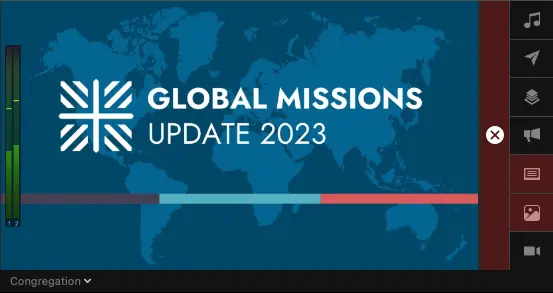
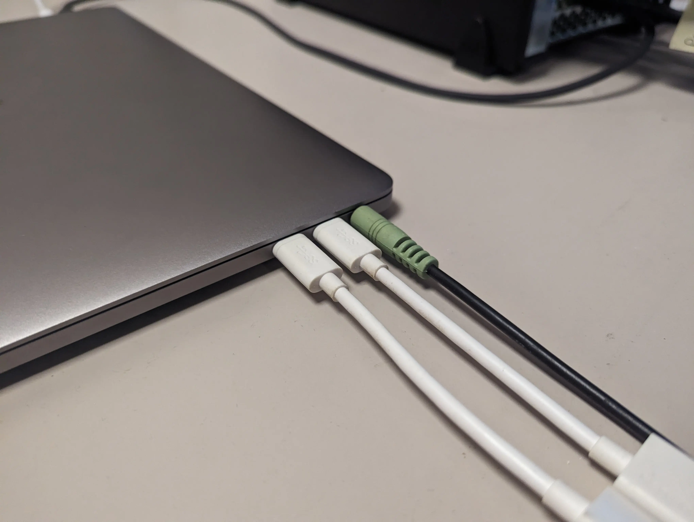
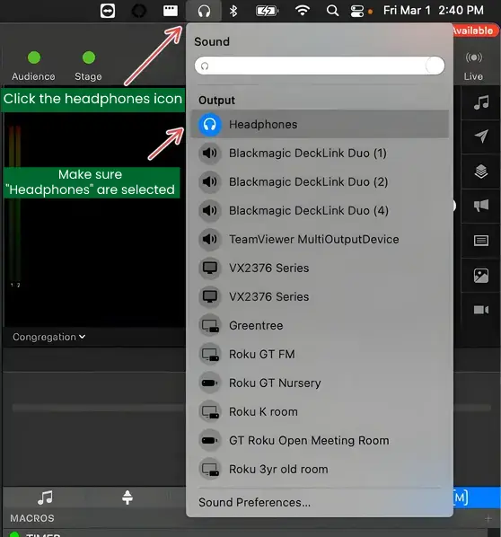
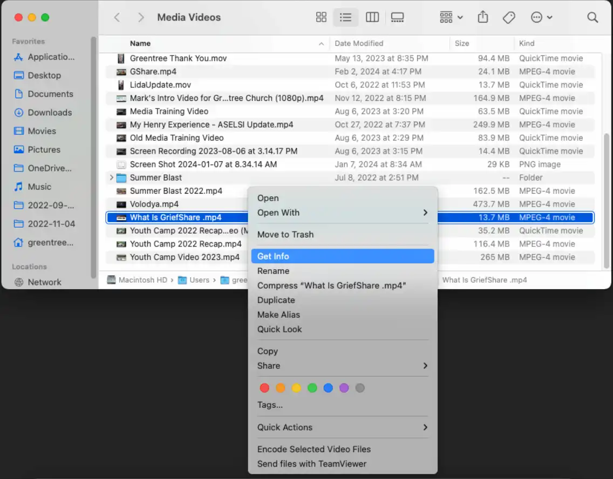
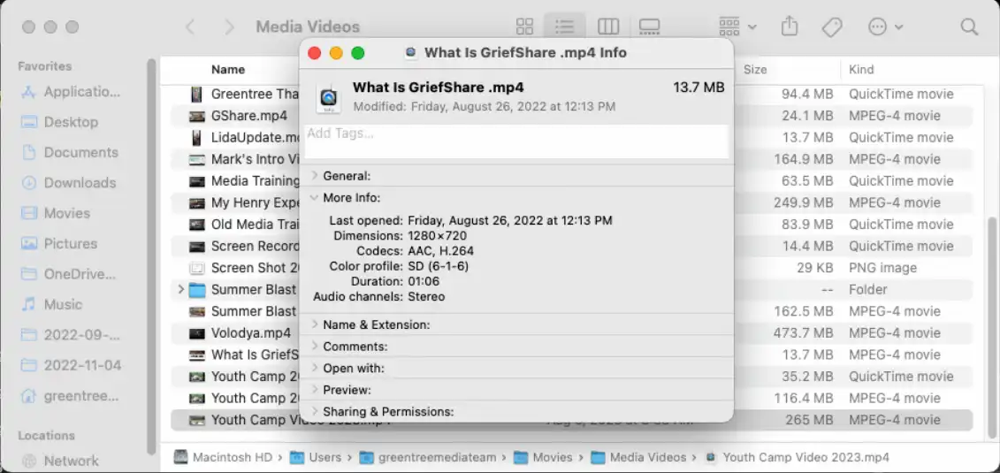

# No Audio in While Playing Video

### Audio Not Playing to Audience

If the output preview in ProPresenter shows the audio levels changing, and the audio booth confirms they're not getting audio.

_Example of audio meters changing while video is playing_

**First, check the physical connection.**

Make sure the 3.5mm cable is properly plugged into the headphone jack of the Macbook.

:::warning
99% of the time, the issue is the audio cable. Make sure the cable is plugged in correctly, and reseat the cable if not.
:::

### Check Audio Output

If the output preview in ProPresenter shows the audio levels changing, and the audio booth was previously getting audio.

Make sure the audio output of the Macbook is still being sent to the headphone jack.

1. Click the Headphones icon at the top right of the screen in the menu bar.
2. Select "Headphones" from the list. It should be at the top.

The current selection will be highlighted blue by it's icon.\
**Make sure _Headphones_ are selected.**

### Audio Levels Not Changing in ProPresenter

First, make sure then when playing the video, the audio levels are changing in the output preview in ProPresenter.

Check the video outside of ProPresenter in something like QuickTime or VLC, to make sure it has audio.

1. Right Click the video, and Click "Get Info"
   

2. Under "More Info", check that "Audio channels" is filled, typically as "Stereo"
   

### Solution

If the video does not have an audio track, there is something wrong with the video file itself, and it might not have audio to begin with.

Try re-downloading the video from Planning Center.
