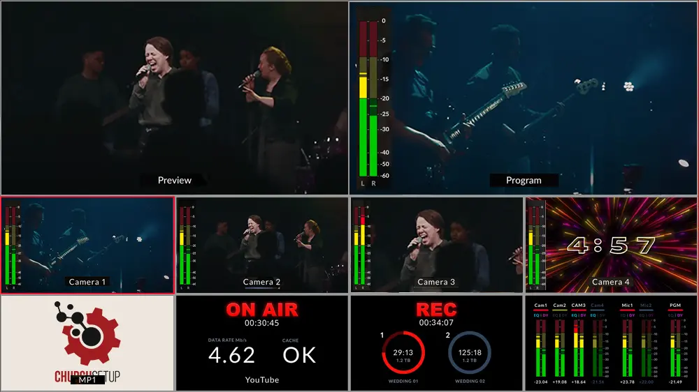
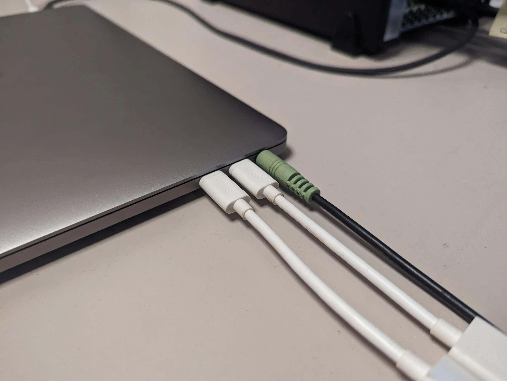
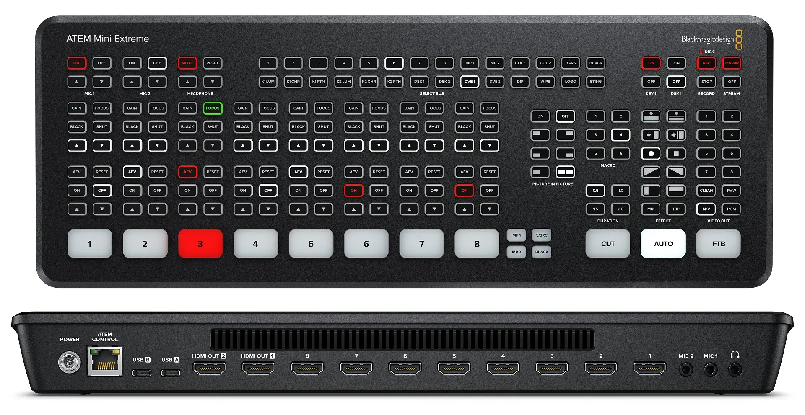

# No Audio in Livestream

### Problem

If the congregation / audience is getting audio, the levels are changing in ProPresenter, but the live stream isn't getting audio

Check to the audio levels of the ATEM. This can be seen in the multiview of the ATEM

In the bottom left of the image, you'll see the multiview preview of audio levels. Check to make sure _both_ Mic 1 and PGM (Program) have active levels.

:::warning[More Info]
In the sample image shown above, their cameras have HDMI output, so each camera can also send an audio signal. That's why to the left of each each camera input, there are audio meters beside them.

Our camera(s) do not have HDMI, so they aren't capturing audio. That's why we don't have audio levels like the image shows do.
:::

We receive audio as a mono mix from the sound board in the sound booth, which we bring in running XLR to 3.5mm TRS, and plug that into Mic 1.

### Solution

If the Mic 1 input doesn't have levels, **check the microphone cable**. It may simply be unplugged, or not plugged in all the way.

If the the Microphone cable is plugged in, but there still isn't audio, check with the audio booth to confirm their output mix is being sent up, or not muted.

If neither input has levels, and the audio booth confirms they're sending audio, make sure the Mic isn't muted.

You can check this by looking at the top left of the ATEM Mini.

Make sure **Mic 1** is set to **on**. If it's set to **Off**, the mic is muted.
