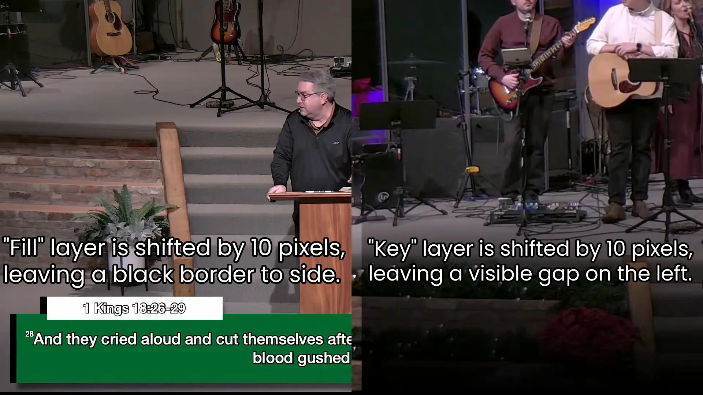
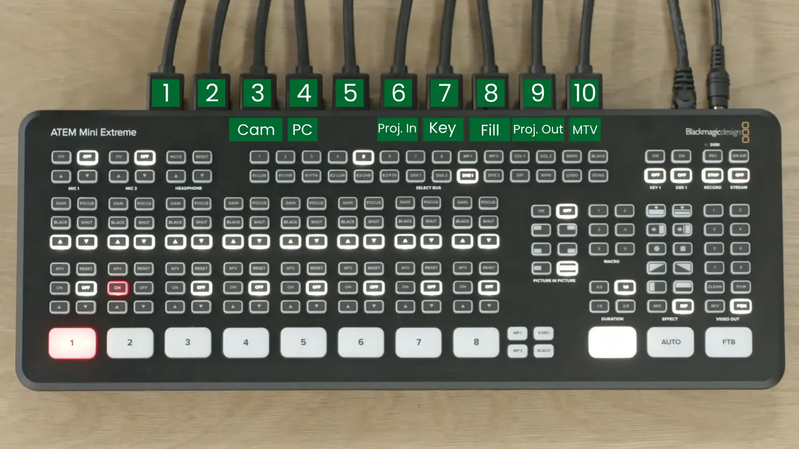

# Lower Third Graphics Issues

Solutions to lower third, on screen graphics issues

## Graphics Shifted Over

### Problem

Over time, the overlaid lower third video graphics can shift slightly to one side.

In the following screenshot, you can see the image is shifted roughly 10 pixels to the right. This issue is cumulative, which is why we're able to see the camera feed to the far left, when it should be "hidden".

Guide to Pro

This can also happen with the song lyrics and scripture. All Lower Third graphics are affected.

### Solution

The issue comes from the HDMI cables running into the ATEM Mini.

**To fix the issue, unplug the correct cables, and plug them back in.**

1. Unplug HDMI input 7 (labelled "Key")
2. Plug back in the HDMI to input 6 (labelled "Key")
3. Unplug HDMI input 8 (labelled "Fill")
4. Plug back in the HDMI to input 7 (labelled "Fill")

The graphic will now be properly displayed on screen.

:::warning
Reseating the HDMI cables will cause the program feed to flicker, as the input is being unplugged and plugged back in.\
This is temporary, and resolves once the HDMI cable is plugged back in.
