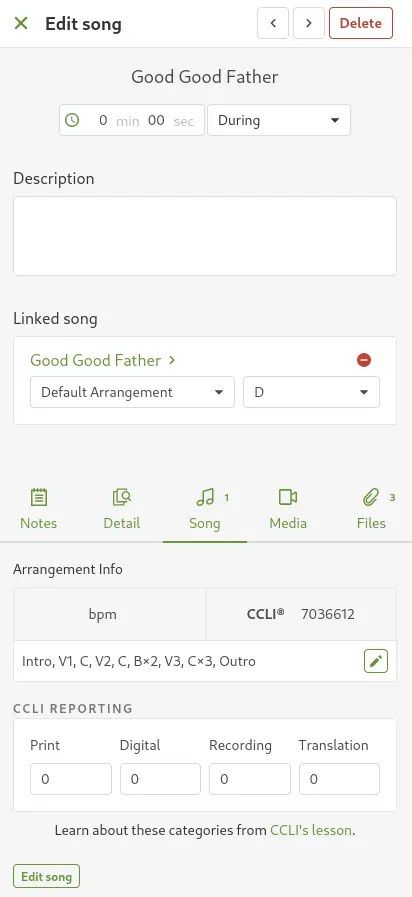

# Adding New Songs

## Written Guide

If a song doesn't show up when searching for it in ProPresenter, [check the last time it was used in Planning Center](./fixing-old-songs#check-in-planning-center)

If the the "Since 3 Most Recent" only shows the upcoming Sunday service as it's "last date" that means it's a new song.

### Planning Center

In Planning Center, select the song, and copy the CCLI number from the Song tab. Make note of the arrangement listed (normally called "Default Arrangement")

<!-- Update with picture of upcoming song -->

<!--  -->

## Video

<iframe width="720" height="480" src="https://www.youtube-nocookie.com/embed/M7z-I2eU654?si=xVcN7xiGftTlwLr4" frameborder="0" allow="accelerometer; autoplay; encrypted-media; gyroscope; picture-in-picture; modestbranding; showinfo=0; fullscreen"></iframe>
