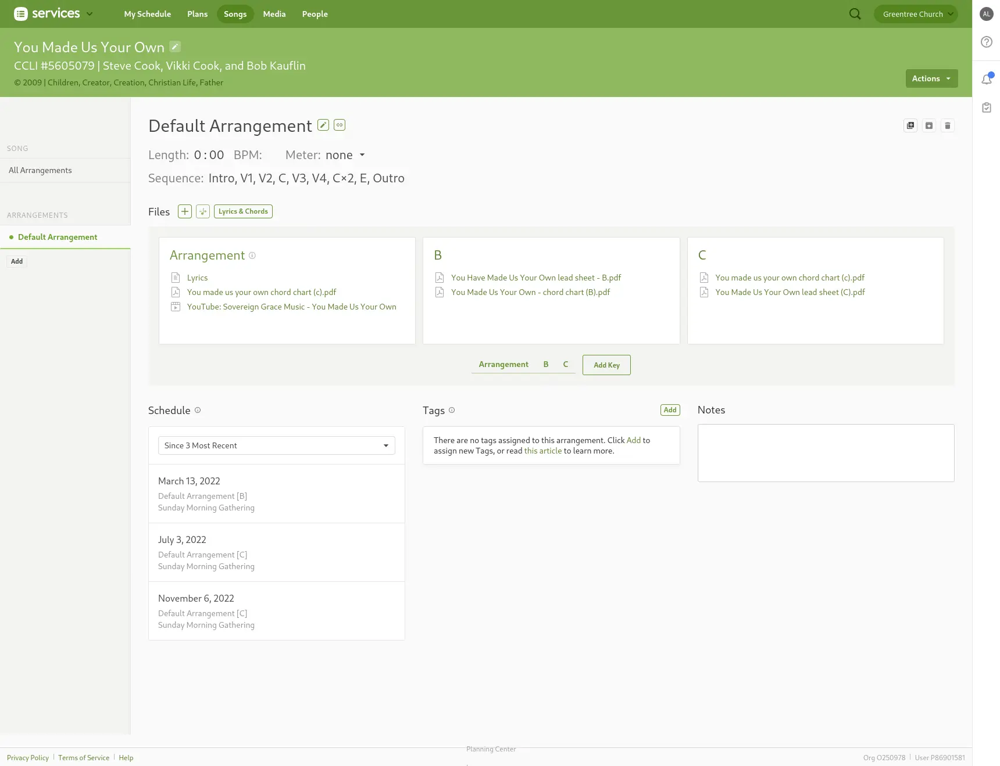
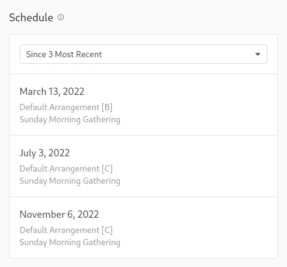

# Fixing Old Songs

## Written Guide

### Check in Planning Center

When searching for a song in ProPresenter either by the CCLI number, if the only results are from other, older Libraries (such as Default or Default 2), confirm that the song is a version we have done before.

You can do this in Planning Center by selecting the song, and under "Linked Song", selecting the title.

:::tip Check Arrangement First
Before fixing the old song, check the arrangement. Some songs will have arrangements made for a specific date named as such (November 22, 2022). You can use this information to check the playlist made for that date, and check what song was used.
:::

This will bring you to the Songs page in Planning Center, we can see more information about the song.

Under "Schedule", we can confirm that the last time the song has been used. If the song was last scheduled before 2022, it is more likely than not an older song we have not added to yet updated to our new formatting.

If **"Since 3 Most Recent"** only shows once, and it's for the upcoming service, that means [it's a new song that needs to be added](./1-adding-new-songs.md)

### ProPresenter

1. In ProPresenter, search for the song by CCLI number.
2. Right click the song from the list, and select "Show in Library"

<!--  -->

## Video

<iframe width="720" height="480" src="https://www.youtube-nocookie.com/embed/M7z-I2eU654?si=xVcN7xiGftTlwLr4" frameborder="0" allow="accelerometer; autoplay; encrypted-media; gyroscope; picture-in-picture; modestbranding; showinfo=0; fullscreen"></iframe>
