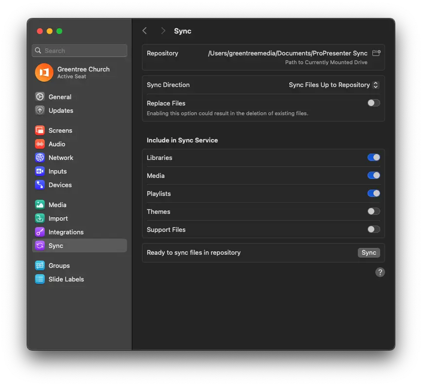

# Syncing Presentations between Computers

## Written Guide

It's often the case that more that one computer will be in use to create slides. One computer may be a desktop only used to run, while another may be a laptop to create slides remotely.

These files are all stored locally on each computer, so we'll need to sync the playlists, media, and presentations between two or more computers.

### ProPresenter

### Sync to another computer

In ProPresenter, we'll head to `Settings -> Sync`. This brings up the settings for syncronization.

### Sync Options Overview

| **Option**            | **Description**                                                                                                                                   |
|-----------------------|---------------------------------------------------------------------------------------------------------------------------------------------------|
| **Libraries**          | With this option checked, all presentations in your libraries will sync.                                                                         |
| **Media**              | With this option checked, all linked media in presentations, playlists, and the media bin will sync.                                                |
| **Playlists**          | With this option checked, all library playlists and media bin playlists will sync. Media must be enabled for the media itself to sync.             |
| **Themes**             | With this option checked, all themes will sync.                                                                                                  |
| **Support Files**      | With this option checked, all configuration files including screen configuration, looks, props, messages, timers, macros, etc., will sync.         |

---

The most important options to make in this step is the ``Sync Direction`` and ``Replacing Files`` options.

``Sync Direction`` determines whether we're putting backing up our presentations into the Sync folder, or restoring presentations from the Sync folder.

We use ``Sync Files Up to Repository`` to put files INTO the sync folder. 

We use this when we have new slides, presentations, or media that we're adding to keep in sync. This is typically done on the computer that we're using to build slides.

In the bottom left, click ``Sync``.

:::caution
“Replace My Files” WILL DELETE any presentations or media on your computer or from the repository. Unchecking it will only replace files with the same name. For example, a file named “Amazing Grace” on your computer will be replaced by the one in the repository. To delete a file from all synced computers, you must manually remove it from both the computer(s) and the repository.
:::

### Sync from another computer

In ProPresenter, we'll head to `Settings -> Sync`. This brings up the settings for syncronization.

Under ``Sync Direction``, we'll select ``Sync Files Down from Repository``

This will bring in all the presentations, playlists, media that we select to keep the computers in sync.

## Video

<iframe width="720" height="480" src="https://www.youtube-nocookie.com/embed/M7z-I2eU654?si=xVcN7xiGftTlwLr4" frameborder="0" allow="accelerometer; autoplay; encrypted-media; gyroscope; picture-in-picture; modestbranding; showinfo=0; fullscreen"></iframe>
