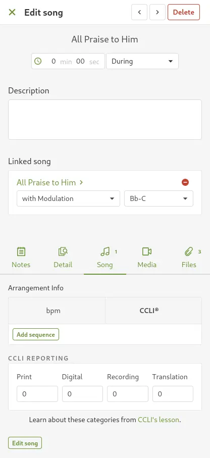
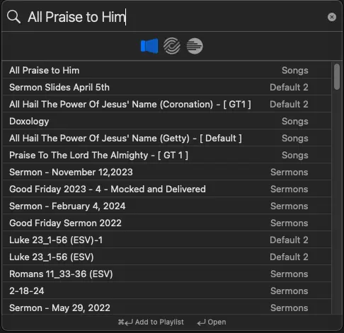

# Adding Songs without CCLI Number

## Written Guide

Sometimes, a worship leader forgets to add in the CCLI number or arrangement information of a song.

In thi

## ProPresenter

1. In ProPresenter, click **Search** in the top left
2. Paste in the song title from Planning Center

If you get a result from the **Songs** library on the left, you can proceed.
<!-- If there are no search results, you may need to [add a new song](./1-adding-new-songs) -->
If there are no search results, you may need to [add a new song](./1-adding-new-songs.md)

## Video
