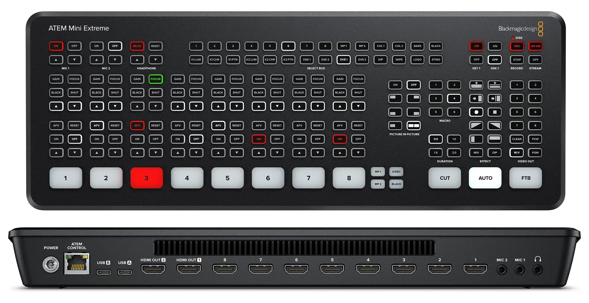

# Muting The Livestream

## How to Mute Livestream

For privacy or security reasons, it's sometimes necessary that we temporarily pause the live stream. We could be covering a sensitive topic, or be concerned for the security discussing details of one of our missions partners.

In these rare cases, we need to put the live stream on a brief hold and resume afterwards

### Technical

Technically, it's not possible for us to "Pause" the live stream. If YouTube stops receiving data for the broadcast, after one minute, the live stream will automatically end.

To get around this, we handle "pausing" the live stream by using some features built into the ATEM.

## Written Guide

### Put "Be Right Back" on Screen

Pausing the live stream is handled using the ATEM Mini.

1. Press **"MP1"** on the ATEM. It should light up Green, meaning it's in Preview. It's to the right of **8** at the bottom

   

   You'll see the "Be Back Soon" screen in the Preview section of Multiview

   

2. Press "Auto" on the ATEM to put the BRB screen on Program

   This will make the "Live", so that's now what the live stream sees. You can confirm this in the MultiView

### Mute Audio

On the ATEM, we'll also need to mute audio, so the live stream

1. Press **"Off"** above **"Mic 1"**

It's located at the top left of the ATEM, pictured below

This mutes the live stream, so the live stream no longer hears anything.

## Video
