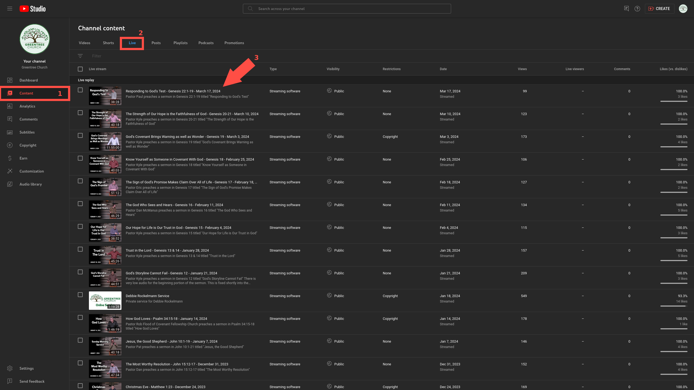
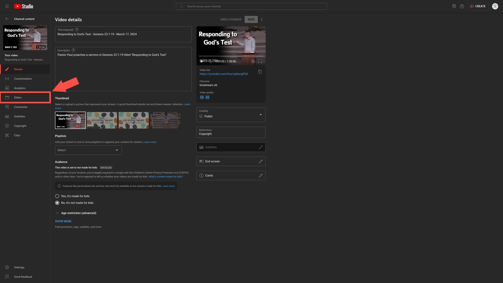
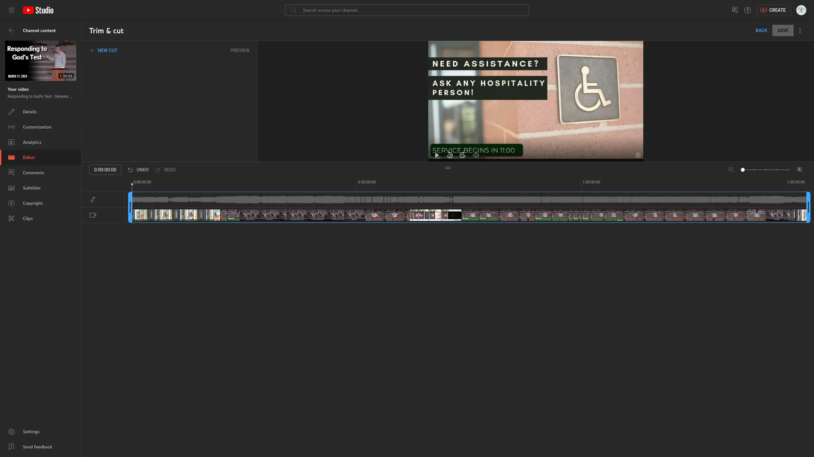
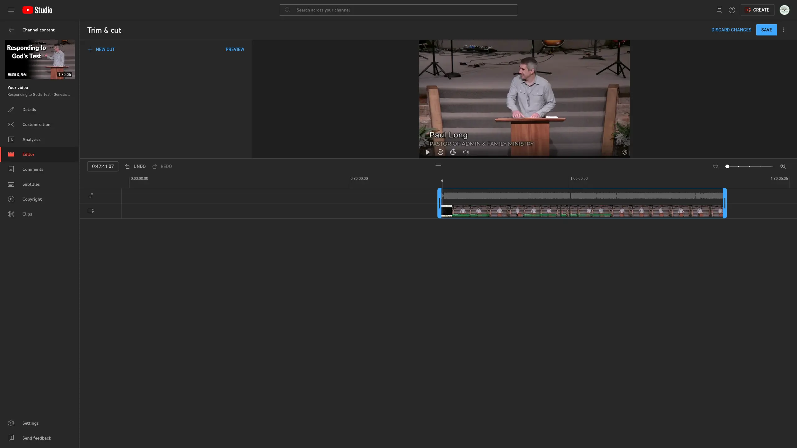
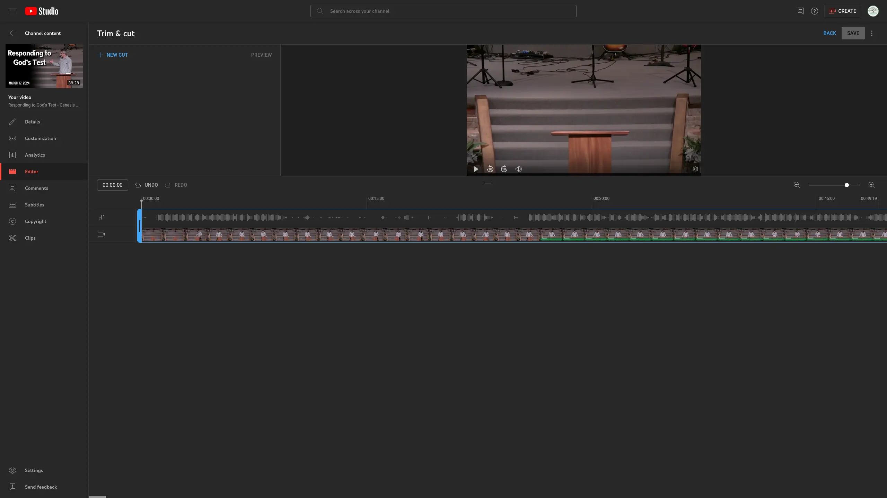
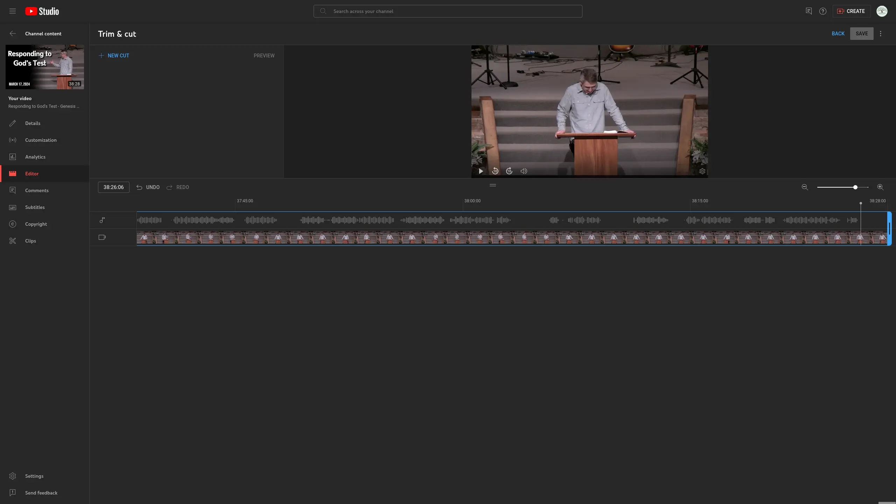
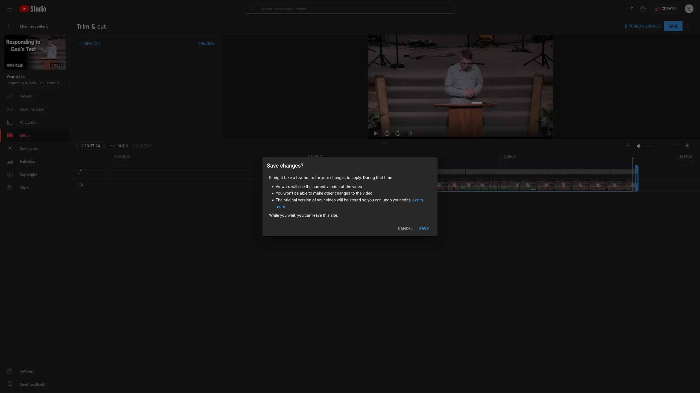

# Trimming Livestream

## Written Guide

Every week, we trim the full live stream down to just the sermon.

This way, those watching the live stream get the full experience of worship, church live, and the sermons, and those visiting afterwards can get right into the archived copy of the sermon.

### Navigate to Video

1. Navigate to the latest Video by going to [YouTube Studio.](https://studio.youtube.com/)
2. From the left side menu, select **Content**
3. From the top bar, select **Live**
4. Click on the thumbnail or title of the latest live stream to start editing.
   
5. From the left menu, select **Editor**
   

### Trimming the Livestream

1. Select Trim & cut. A blue box will appear in the editor.
   

:::caution fyi
The blue box represents the start and end of the video. Make sure they're in the right spot.
:::

2. Drag the sides of the blue box. Preview the video from the player in the top left to see where you are.

   

### Trim to Start of Sermon

1. Put the beginning of the box where the sermon begins, just as the speaker or pastor walks up to the podium.

Typically, we leave a bit of wiggle room to the opening. We'll start the video just as the speaker is walking to the podium, just as they walk into frame, as they say good morning, or as they say to open your bibles.

This gives a moment for the viewer to see see who's speaking, without waiting 5-10 seconds for someone to get on stage, or to start so quickly it's too jarring.

2. Use the **Preview** button to the left of the video player to get to preview how the video will start

### Trim to End of Sermon

Drag the other side of the blue box to the end of the sermon

We stop the video end the end of the sermon, just before they go into prayer. We cut just after they say "Let's Pray", and give a moment of silence before they start praying.

If they jump immediately into prayer, we typically cut at the last point they were making.

In the above example, you can see there's a few seconds of silence where we cut just before they go into prayer.

The important part is the give just a moment of silence after the sermon ends, so the video doesn't suddenly stop ab

### Save Changes

When you're ready to commit to this version of the live stream, hit **Save** in the top right.

A warning will pop up on screen, asking to confirm your changes. This warning also states that all changes are final, and that the full live stream will be viewable for a few more hours until the trimmed version is processed.

You can click Cancel to double check your work, or click Save to confirm that changes.

:::danger
All changes are final. Double check that the video start and ends at the right time.
:::

Official instructions to trim down a live stream are also [from YouTube themselves](https://support.google.com/youtube/answer/9057455?hl=en).

## Video
