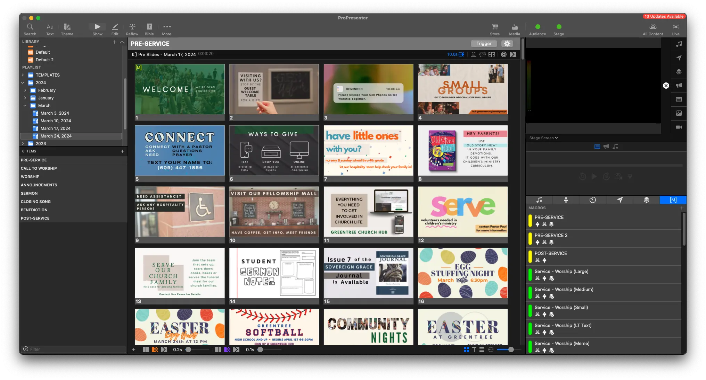
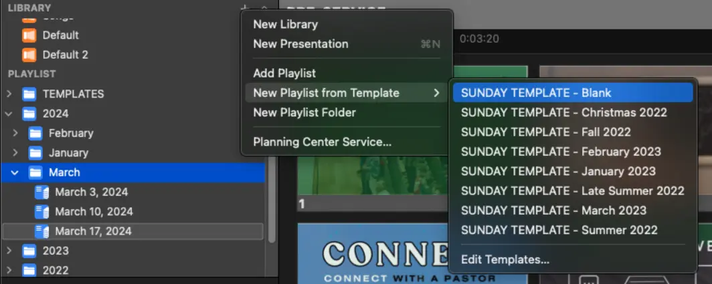

# Creating First Presentation

The start building our slides in ProPresenter 7, we'll first need to create our presentation.

Navigate to the **Library View**, and find the correct Year and Month under **Playlist**

1. Click on the current month to select it. Then, in the top right corner of the Library View. Click the **+** icon to show options for creating a presentation.

From the Dropdown, select **New Playlist From Template** -> **SUNDAY TEMPLATE - BLANK**

This will add a new, empty presentation into the folder we had selected.

2. Right Click the empty presentation (it should be called 'SUNDAY TEMPLATE - Blank') and rename it to the date of the service (ie March 24, 2024)

You'll now have an empty presentation, ready to be built up into the Sunday Service

To get started building out our presentation, let's first [add names to the presentation](./2-adding-names.md)
