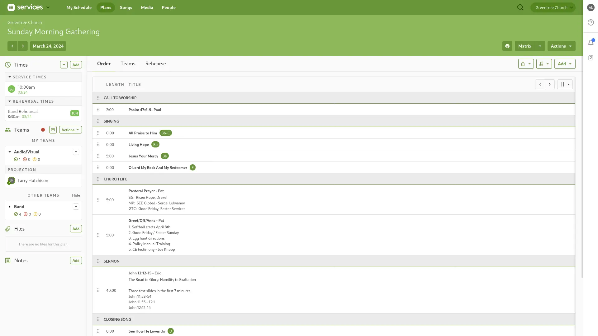
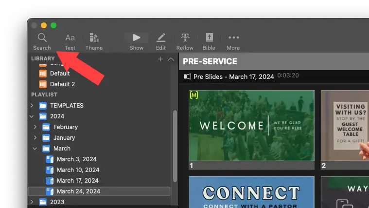
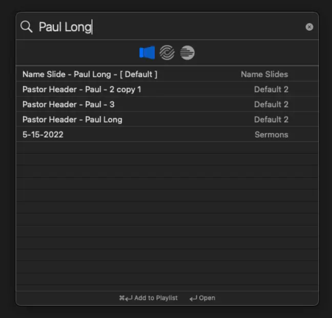
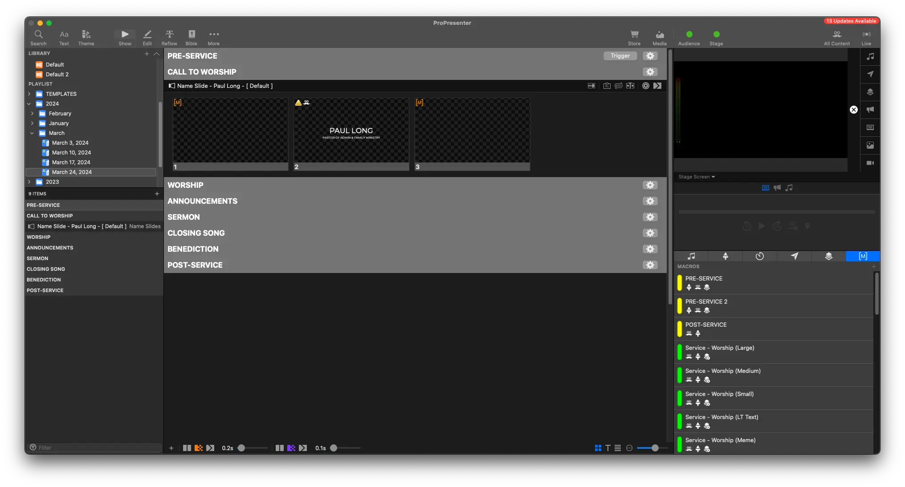
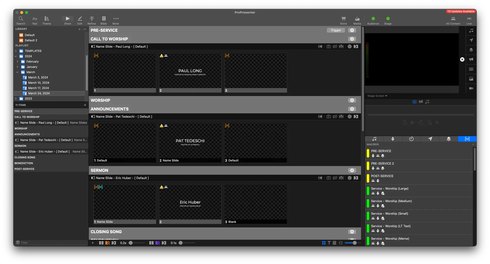

# Adding Names

## Written Guide

In Planning Center, you'll have a general overview of the service, including who's doing the call to worship, announcements, and the sermon.

<!--  -->

Here, we can see Paul Long is doing the Call to Worship.

1. Click the Search icon in the top left of ProPresenter (you can also hit Cmd/Cntrl + F)

2. This brings up the search window. Type in "Paul Long"

3. Find the speaker from the list. You'll notice on the right side of the search window, it should say "Name Slides". This is the Library the Name Slides are stored in, to keep them organized.
4. Click and drag the selection into the correct order of the service. In this case, "Call to Worship"

<!--  -->

You should now see the Pastor listed in the correct spot.

We can do the same search for any other names that need to be added into the service

## Video

<iframe width="720" height="480" src="https://www.youtube-nocookie.com/embed/M7z-I2eU654?si=xVcN7xiGftTlwLr4" frameborder="0" allow="accelerometer; autoplay; encrypted-media; gyroscope; picture-in-picture; modestbranding; showinfo=0; fullscreen"></iframe>
