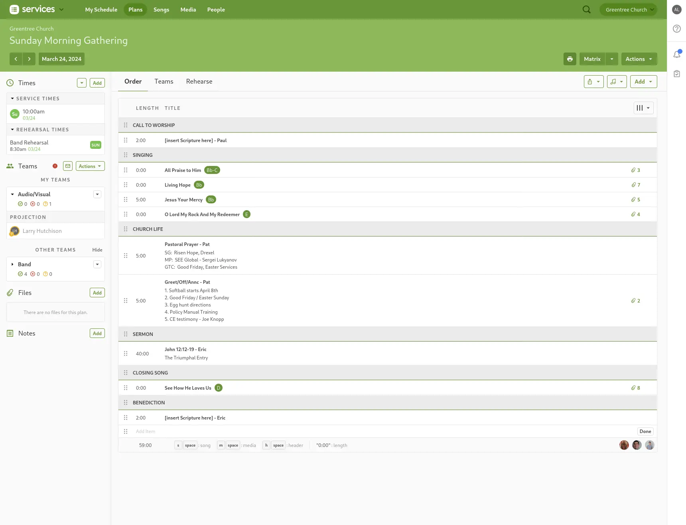
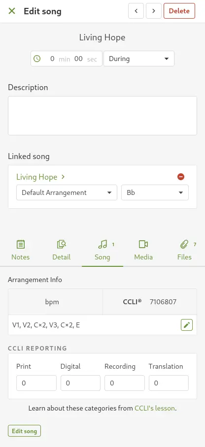
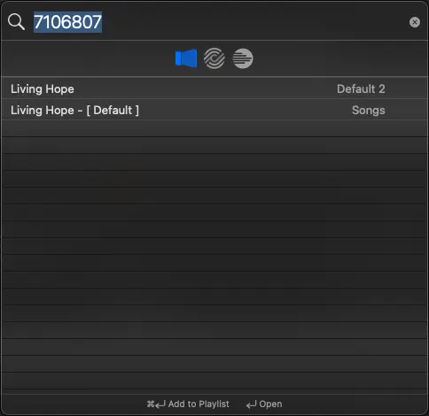

# Adding Songs

## Written Guide

In Planning Center, you'll have a general overview of the service, including who's doing the call to worship, announcements, and the sermon.

Under **Singing**, you'll see a list of songs. There's also a song listed at the end under **Closing Song**.

:::caution Keep an eye out

Always check the overview of the service in Planning Center to have all the songs. Sometimes, services can have more than one song after Worship, such as Communion Sundays

:::

### Info from Planning Center

Click on the title of a song to bring up the Information Pane on the Right

1. From the small tabs in the center, Click on **Song**.
2. Under "Linked Song", keep note of the Song's Title and Arrangement.
   In the above screenshot, the **title** is "Living Hope", and the **Arrangement** is "Default Arrangement".
3. Under "Arrangement Info", copy the **CCLI number**. This is the unique ID number for the song. Every song has a different CCLI number.

### ProPresenter

1. In ProPresenter, click "Search" from the top left

2. Paste in the **CCLI Number** into the search field.

3. Drag and drop the song from the **Songs** library into the playlist.

:::caution Multiple Songs

If there are multiple songs listed, on the right side of the Search Pane, select the song from the **"Songs"** Library. \
If there are no results, check to make sure. Otherwise, you may need to

:::

## Video

<iframe width="720" height="480" src="https://www.youtube-nocookie.com/embed/M7z-I2eU654?si=xVcN7xiGftTlwLr4" frameborder="0" allow="accelerometer; autoplay; encrypted-media; gyroscope; picture-in-picture; modestbranding; showinfo=0; fullscreen"></iframe>
