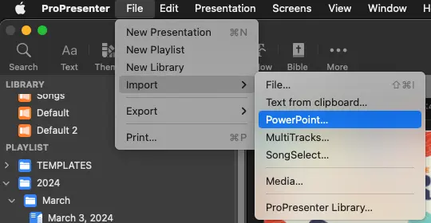
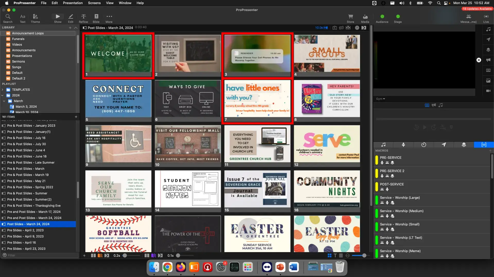

# Pre and Post Slides

Every service, we have slides that runs during the pre-service, before the service starts and post service, after the service ends.

We call these **Pre Slides** and **Post Slides**, so let's learn how to build them out.

## Written Guide

### First Steps

Similarly to the announcements, first, we need to download the slides from Planning Center.

These can be found by clicking on the **Announcements** under Church Life to bring up the detail view.


Then, download **Pre Post Slides - DATE** from the Files Tab


### Import Slides

First, let's import the slides into ProPresenter.

1. In ProPresenter, select

```
File -> Import -> PowerPoint
```



2. Select _Pre Post Slides - Current Date_ from the files list in Downloads

   

   Make sure it's being imported into the **Announcement Loops** Library

   

   The annoucements should now be imported, and at the bottom of the Playlist


3. Right Click the Announcements Loop, select **Show in Library**

   

   You'll now be in the **Announcement Loops** library with the announcement slides selected

   

4. Rename Pre Post Slides

   Right click the Pre Post Slides, select Rename, and rename to "Pre and Post Slides - Month Day, Year"

   

   

5. Set Advance Timer

From the presentation toolbar, select the timer, and set it to **10 seconds**


The toolbar should now read 10.0, meaning it'll advance to the next slides after 10 seconds and loop around.


### Pre Slides

1. Duplicate the Pre Post Announcement Loop slides


2. Rename them to **Pre Slides - Month Day, Year**


3. With the **Pre Slides** selected, add the **PRE-SERVICE MACRO** to the first slide

You can do this by right clicking the first slide and selecting

```
Add Action -> Macro -> PRE-SERVICE
```


This can also be done by navigating to the Macro page and clicking and dragging the yellow **PRE-SERVICE** macro to the first slide before letting go to place it there.

### Post Slides

1. Duplicate the Pre Post Announcement Loop slides


2. Rename them to **Post Slides - Month Day, Year**


3. Remove unneeded slides

Remove slides that aren't relevant for after service

Typically, these are slides like the **Welcome Slides** and **Child Care Dropoff**

Right click the irrelevant slide and select **Delete**



After removing irrelevant slides, it should look like this.


4. Add Post Service Macro

With the **Post Slides** selected, add the **POST-SERVICE MACRO** to the first slide

You can do this by right clicking the first slide, and selecting

```
Add Action -> Macro -> POST-SERVICE
```


### Add Slides to Playlist

Click the Search icon in the top left


Search for "Month Day, Year"


You should see everything relevant for that service, which is why we name it that way.

Place the Pre and Post slides appropriately either at the **Pre-Service header** or **Post Service Header**


## Video
