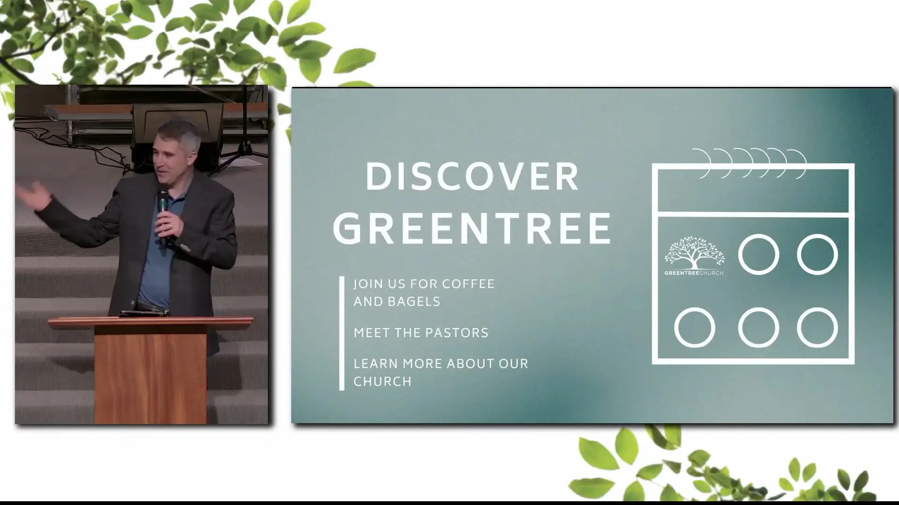
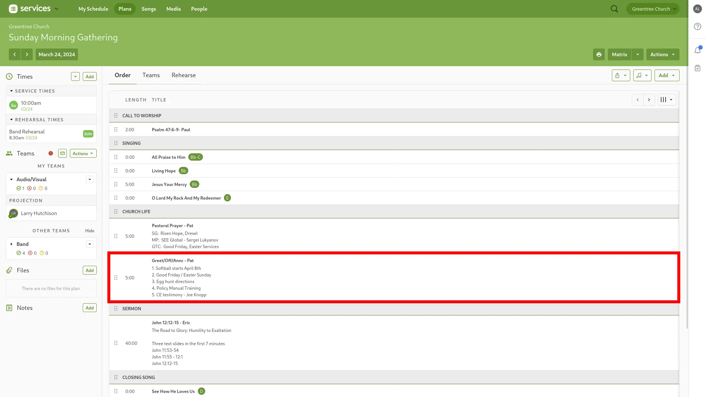
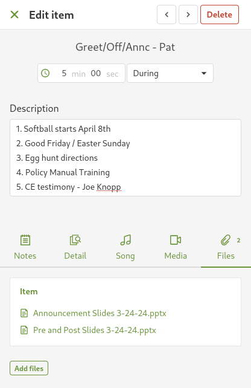
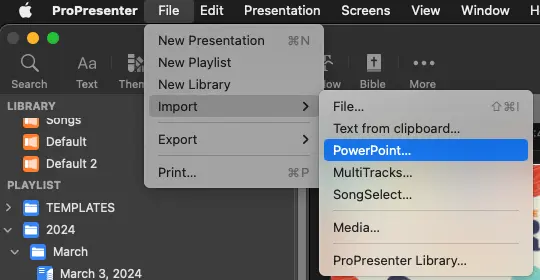
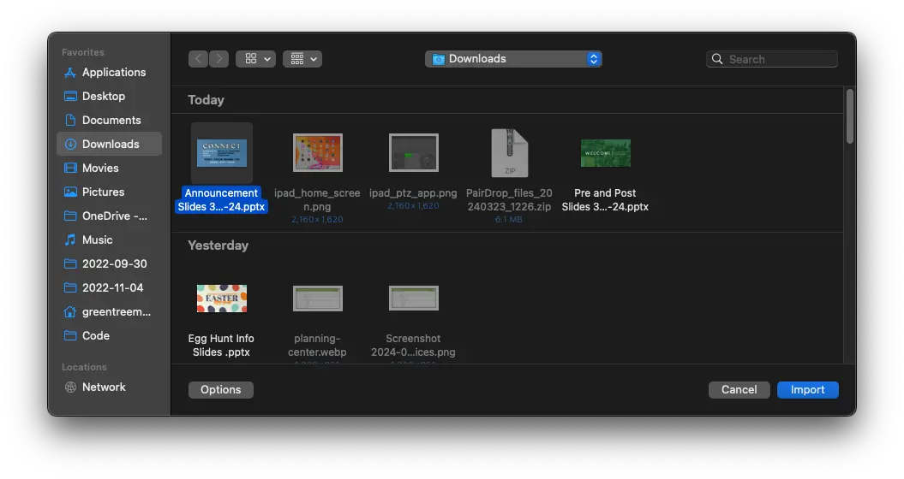
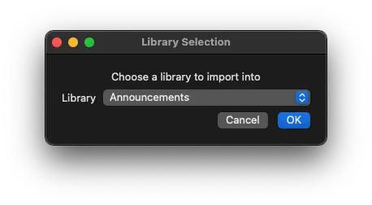
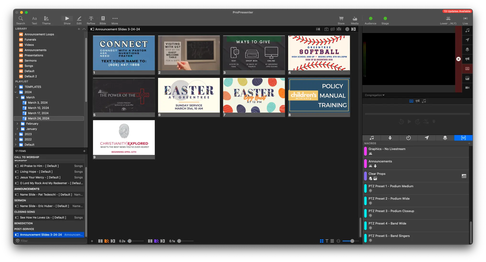
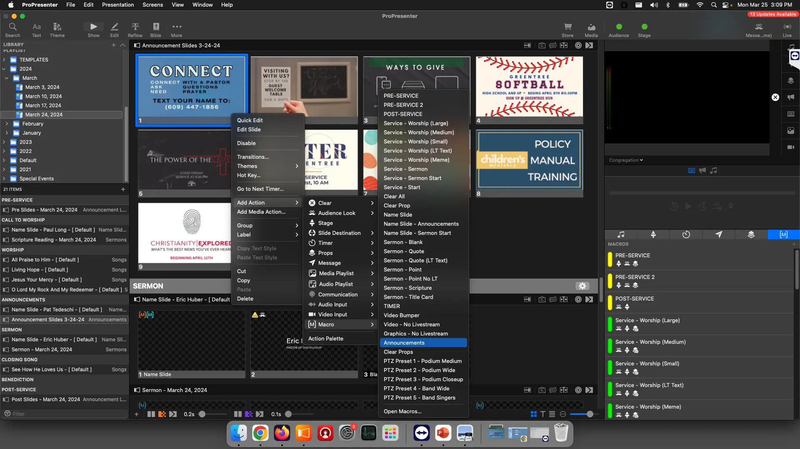

# Announcement Slides

## Written Guide

Announcements happen right before the sermon, and after prayer.

They'll look like this to the audience.


And like this for the live stream.



### Planning Center

Similarly to the announcements, first, we need to download the slides from Planning Center.

These can be found by clicking on the **Announcements** under Church Life to bring up the detail view.



Then, download **Announcement Slides - DATE** from the Files Tab



### Import Slides

First, let's import the slides into ProPresenter.

1. In ProPresenter, select

```
File -> Import -> PowerPoint
```



Select the **Announcement Slides - Current Date** from **Downloads**, and click Import



From the Library Selection drop down, select the **Announcements** Library



The Announcement Slides will now be imported at the bottom of the playlist



You can move the announcement slides into the right place, after the name slide under the **Announcements** header

### Add Macro

Right click the first slide of the announcements, and select

```
Add Action -> Macro -> POST-SERVICE
```



You can also add the macro by clicking and dragging the yellow **POST-SERVICE** macro from the Macro page, and letting go over the first slide.

## Video
