# Main Point

## Written Guide

Main points are typically added to the sermon to summarize the sermon.

Main Points will look like this for the congregation

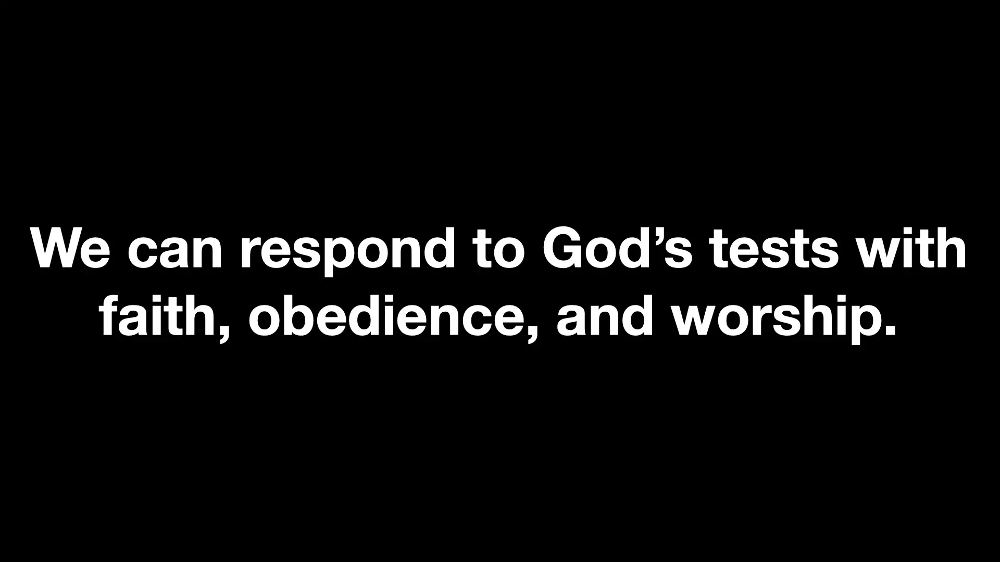

And like this for the live stream

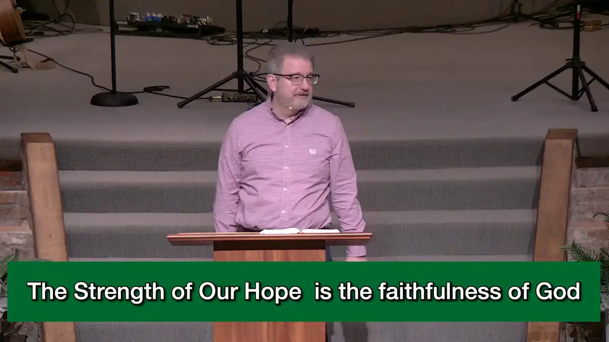

### Planning Center

Click on the sermon in Planning Center to bring up the description

You can copy the text from here.

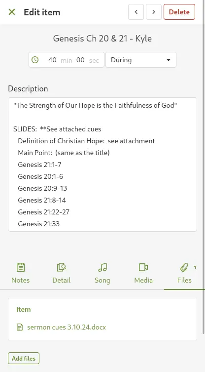

It may also be attached to the **Files** tab in Planning Center. Download the Word Document and open it to follow along.

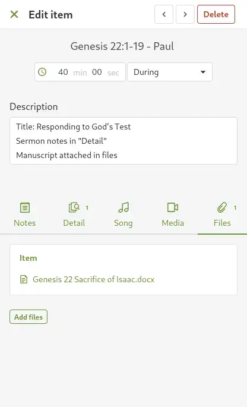

Most pastors highlight anything they need projected.

We see this with Kyle

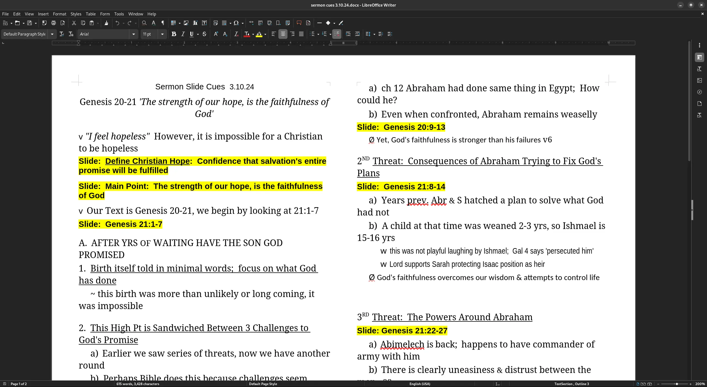

As well as Paul

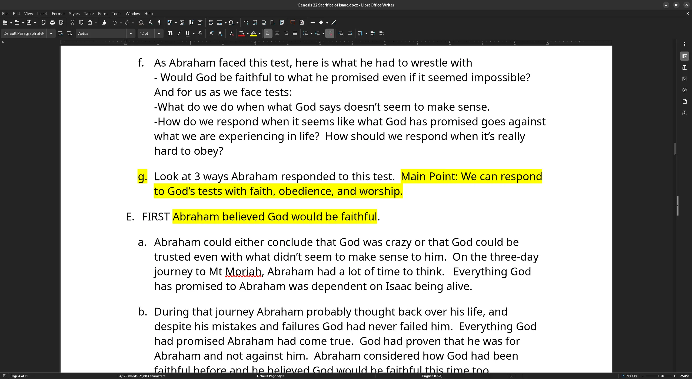

:::warning
Always read the descriptions in Planning Center. In some cases, they may have a request.

In this case, Paul requests each bullet point also have the previous point.
:::

### ProPresenter

In ProPresenter, navigate to the sermon.

At the bottom left of the sermon, select

```
+ -> Message -> Main Point
```

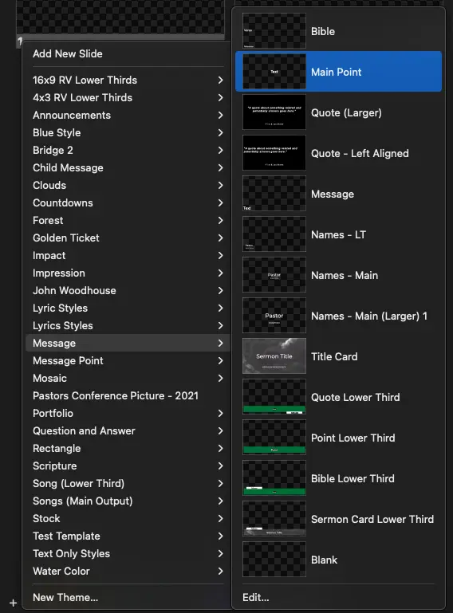

A Main Point Slide should now be added onto the sermon.

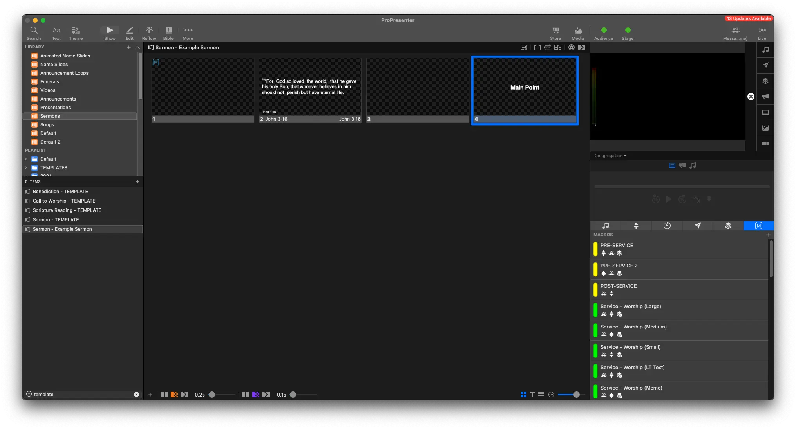

Right click the slide, and select **Edit**

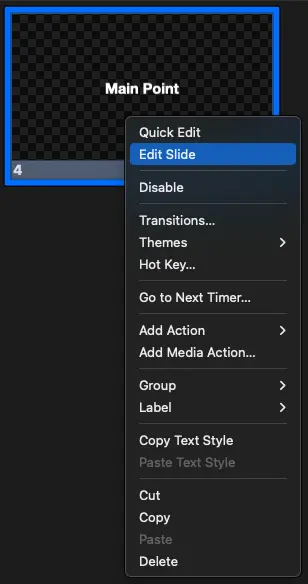

This should bring you into the **Edit Page**

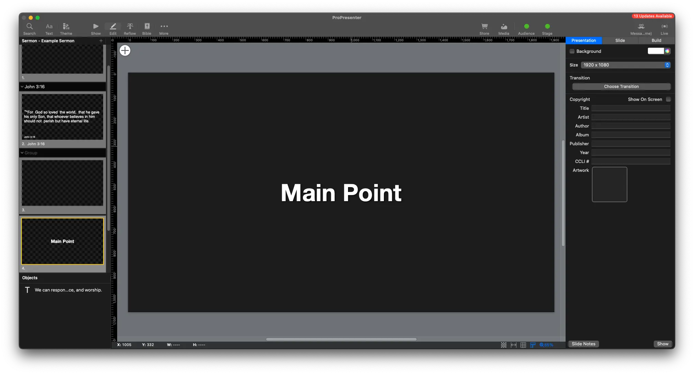

If you didn't already, copy the Main Point text from Planning Center or the Sermon Cues.

With the text selected, right click and select **Paste and Match Style**

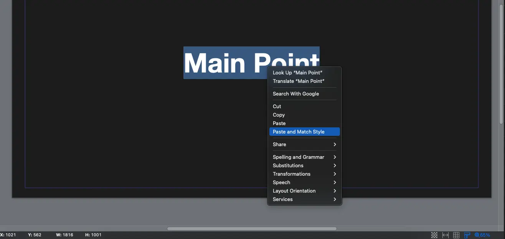

The text from the main point should now be added.

Add line breaks where needed if it breaks awkwardly.

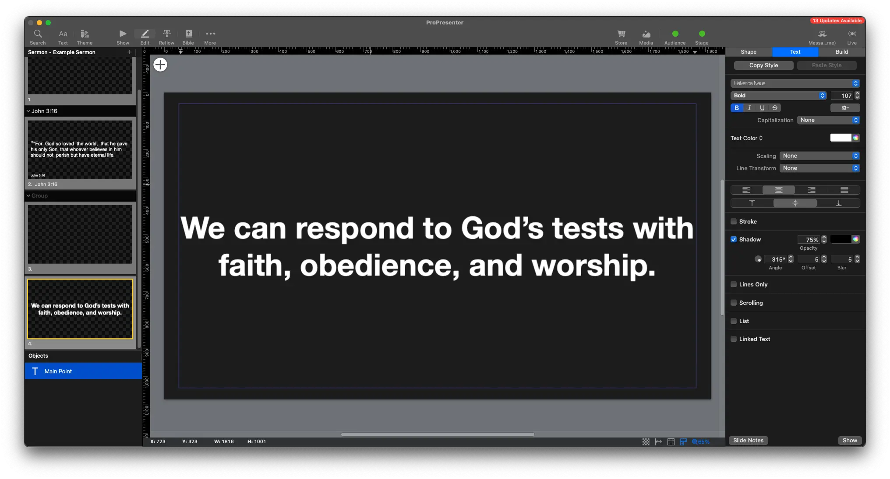

Go back to the **Show Page**

Right click the slide, and select

```
Add Action -> Macro -> Sermon (Point)
```

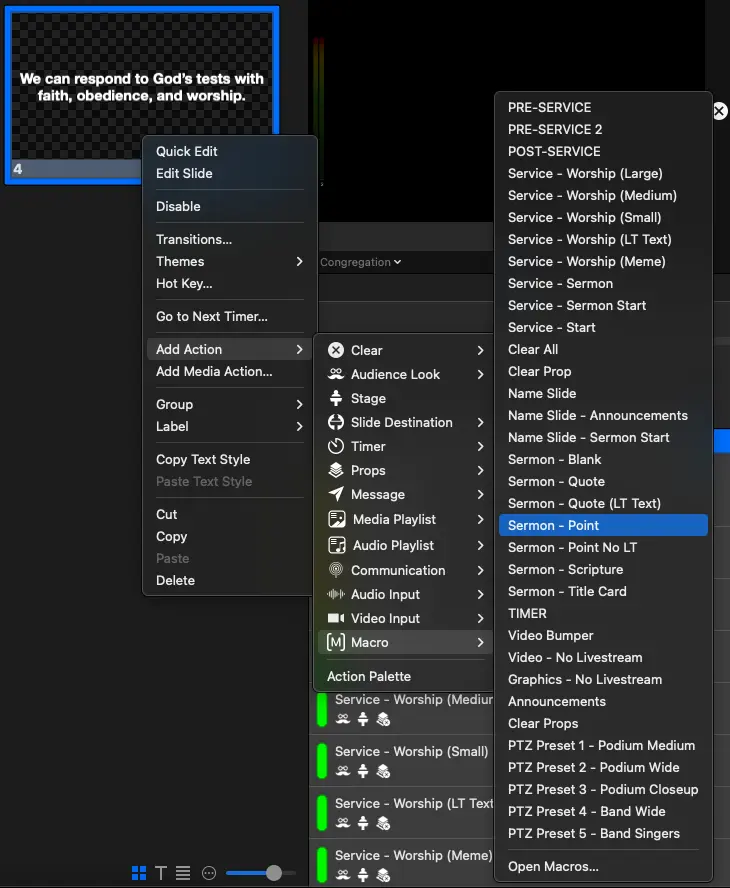

Don't forget to add a blank slide in afterwards

```
+ -> Add New Slide
```

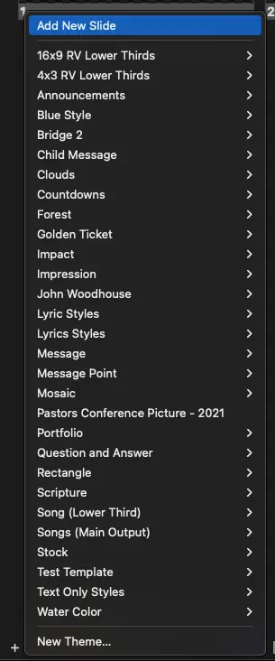

The main point should look something like this.

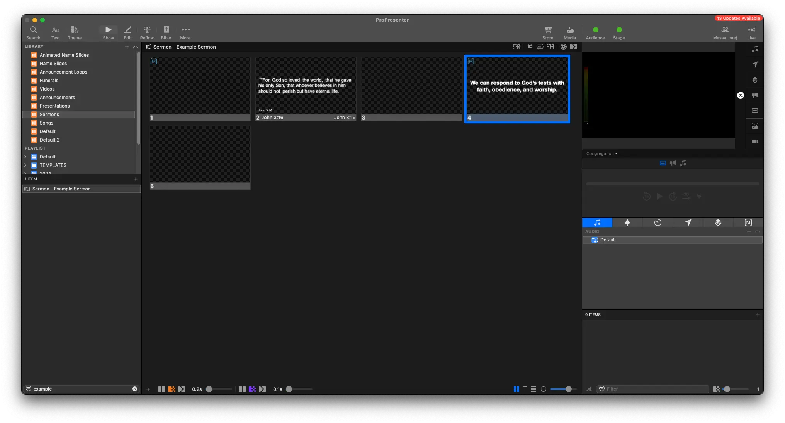

## Video
