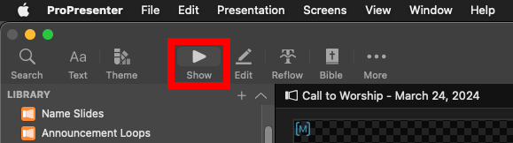

# Adding Quotes

Quotes are commonly used when quoting another pastor, a speaker, a book, or other reference.

Quotes will look like this to the congregation.


And like this for the live stream.


## Written Guide

### Planning Center

First, we'll get the quote we need from Planning Center.

These are typically in the sermon notes, either as an attached file or in the description.


Copy the text of the quote.


### ProPresenter

To add the Quote slide, in the Presentation, from the bottom left, select

```
+ -> Message -> Quote (Larger)
```


The quote slide is now added


Right click the new slide, and select **Edit**


This will bring you to the edit page of the slide.


Select the text in the middle (you'll see **Quote** selected in blue on the side under **Objects**), and select **Paste and Match Style**


You can repeat this process, copying and pasting the author's name and selecting **Paste and Match Style**


Go back to the **Show** view at the top



Right click the slide, and select

```
Add Action -> Macro -> Sermon - Quote
```


The quote should now be added on the screens.

You can repeat this process for any other quotes.


### Reflow Quotes

If the quote is there is too much text on screen, it can be hard for the viewer the follow along.

That's why it's necessary to separate the quote between a few slides, so more text can be on screen.


In the above screenshot, while the whole quote is on the screen, it's a bit too much much. We want to keep the quote at around 5-8 lines lines.

In the example, it's at 11 lines, and looks too wordy.

Here's how to fix it

1. From the top toolbar, select **Reflow**

   

2. Scroll down in the text, and click to place the cursor where you want to split the slides.

   

3. At the bottom left, click **Insert Slide Break** to split the slides

You'll see the slides are now split.


However, there is a bug in ProPresenter 7.10 that duplicates the text to the next slide, instead of just splitting it

#### Solution

Select the duplicated text, and delete it


## Video
