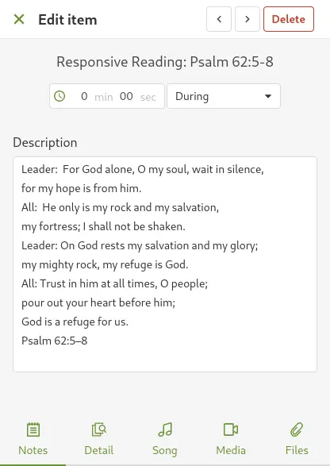
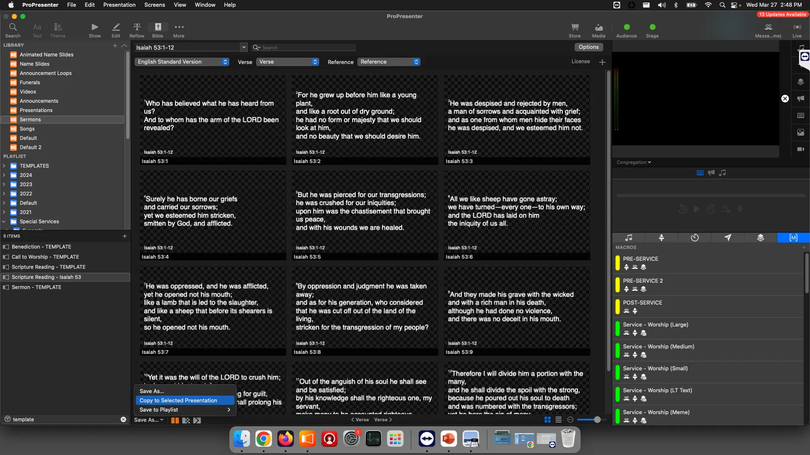
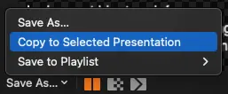

# Scripture Reading

## Written Guide

### Planning Center

In Planning Center, scripture reading is typically done by a speaker from the audience, or it's something put in by a worship leader.

In this case, it's added between a few songs, and was labeled "Responsive Reading"


Click on the item to get more detail if needed.

All we really need is the scripture they're referencing, which can be in the title AND the description.



OR the info may only be in the title.


Either way, copy the scripture as needed.

### ProPresenter

In Planning Center, navigate to the **Sermons** Library.


In the bottom left of the playlist view, look for the search box


Search for **Template**


Duplicate the **Scripture Reading Template**


Right Click the copied template, and select **Rename**


Rename it to be relevant to the current event


:::tip
Add the event name or date to the end of the scripture. This will make searching for it far easier.
:::

From the Toolbar at the top, select **Bible**


This will bring you to the Bible Page


Paste in the scripture to the search bar at the top


**Make sure the scripture reading is selected from the Playlist View**
With the scripture reading selected, at the bottom left, select

```
Save As -> Copy to Selected
```




From the Toolbar, you can select **Show** with the Play icon to get back to the show view


Move the blank slide to the end of the scripture


That's it! 🎉

You can now go back to the correct Playlist, and look up the name of the event


Drag and drop the scripture into the correct place in the playlist.

## Video
