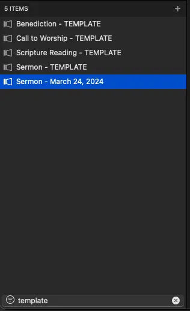

# Sermon

## Written Guide

### Intro

Let's go through the basics of making a sermon.

This will be the most basic version of a sermon, where only scripture is needed.

:::tip Links
This guide is for a minimal version of a sermon.

To see a full guide on sections like adding main points, bullet points, or sermon picture, navigate to [the Sermon Guide.](../../../category/sermons)
:::

### Planning Center

First, we'll check into Planning Center to see what scripture is needed.


We can click on the sermon to get an overview of what's needed.


In this case, it's just scripture. We'll copy the scripture as needed from here.

### ProPresenter

In ProPresenter, we'll navigate into the **Sermons** Library


In the bottom left search field, we'll look for **Template**


We'll right click the **Sermon - TEMPLATE** and select **Duplicate**


Right Click the duplicated sermon, and select **Rename**


We'll rename it to the date of the sermon or event, typically in **Month Day, Year** Format



With the sermon selected, click the **Bible** at the top toolbar to get into the **Bible Page**


In the search bar, we'll paste in whatever scripture we need


If scripture looks like it's taking up too many slides, or too little, try checking or unchecking **Break On Verse** from the options


With the Sermon selected, at the bottom left, click

```
Save As -> Copy to Selected
```


:::warning
Make sure the sermon is selected when copying in scripture. Otherwise, the scripture will be added to the wrong presentation.
:::

You can now click the **Show** button at the top toolbar to go back to the presentation, where you should see the scripture added.


Move the blank slide from before the scripture to the end


Double check that the **M** Macro on the first slide is set to `Sermon - Scripture` by hovering over it with your mouse


We'll repeat this same process for any scripture we need to add.

### Adding Sermon to Playlist

We can navigate back to our Playlist, then click the **Search** icon in the top right


We'll search for the sermon by the date or event name


We can now add the sermon into our playlist in the right spot.


## Video
