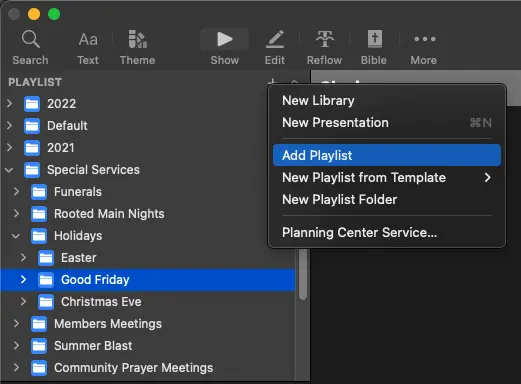
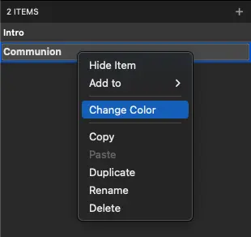
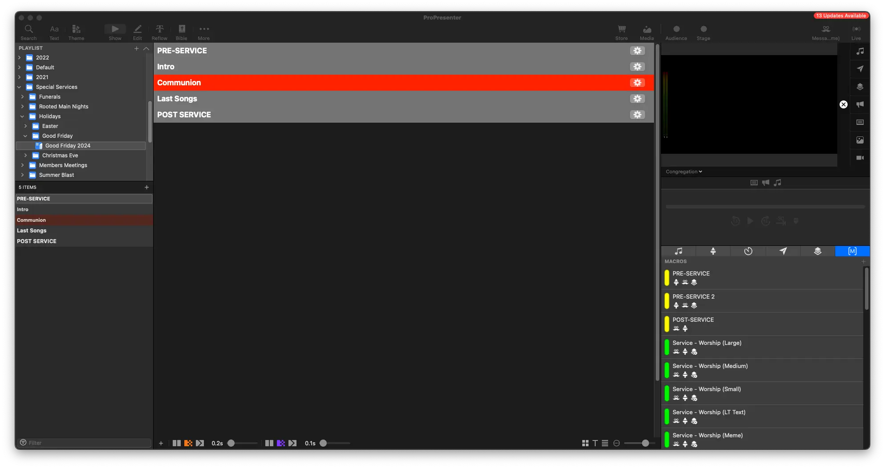
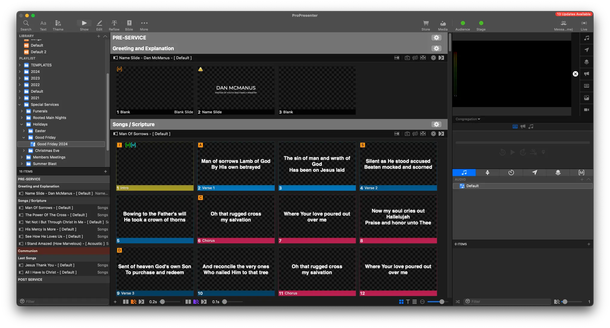

# Holidays

## Written Guide

In this example, we'll go through running an upcoming holiday. In this case, our upcoming Good Friday service.

### Planning Center

Let's get an overview of the service in Planning Center

On the **Plans** page of Planning Center, you'll see any upcoming Special Services under **Special Services**


Click on the service to get into the plan overview

Here is the plan overview for the Good Friday Service, 2024.


For this particular service, you can see it's some scripture reading, followed by a song, repeated a few times.

In this case, we'll just need to add in songs, and the scripture readings.

<!-- TODO: Add working song link -->

:::tip Links

For more details on songs, see [how to add songs.](../../builder-guide/adding-songs)

<!-- TODO: Add working scripture link -->

For more details on scripture readings, see [how to add scripture.](../../builder-guide/sermons/scripture/scripture-reading)
:::

### ProPresenter

In ProPresenter, we'll navigate into the **Holiday Playlist**

We try to keep things organized in the right folder, so we'll make a new playlist in the corresponding folder. In this case, **Good Friday**.

With the folder selected, click the + button at the top right of playlist, and click Add Playlist

```
+ -> Add Playlist
```



Rename the playlist to the name of the event, or something more descriptive. We'll call this **Good Friday 2024**


#### Add Headers

To keep organized, we'll add headers to the playlist.

In the Playlist, click the + Button in the top right, and click **Add Header**


This will add a new header to the playlist. You can add as many as you need to keep organized.

:::danger Add Pre-Post Service headers

Make sure to add Pre-Post Service headers! While it may not always be listed, we still run these before and after events, especially holidays.
:::

#### Change Header Color

You can also change the color of a header by right clicking it, and selecting Change Color




This helps visually identify parts of the service.

Communion can be done in red, or a baptism in blue, to help see where you are much easier.

#### Headers Added

Here's how the completed service can look




From here, we'll go add in add songs and add scripture readings,

### Names

We'll add in our name slides for the relevant speakers. In this case, it's only Dan, so we'll only add one at the beginning


### Songs

We'll do the same with any songs, searching for the CCLI number and placing them all in the correct order in the service.



### Scripture Readings

Lastly, we'll add in the scripture readings. They're all named after the name of the event (Good Friday 2024) to find them more easily.

More headers were also needed, to help visualize the service flow better.


## Final Steps

Be sure to double check your work between Planning Center and ProPresenter.

Everything in Planning Center should be in ProPresenter, so be sure to not of anything in the the descriptions of an event.

For example, in **The Lord's Supper** portion in Planning Center, there's a description.


Always be sure to read these, because they include notes like "Show John 3:16 at end".

### Links

For more details on songs, see [how to add songs.](../../builder-guide/adding-songs)

For more details on scripture readings, see [how to add scripture.](../../builder-guide/sermons/scripture/scripture-reading)

## Video
