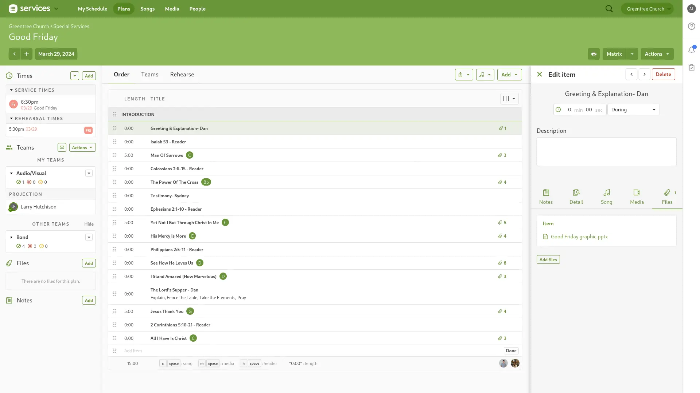
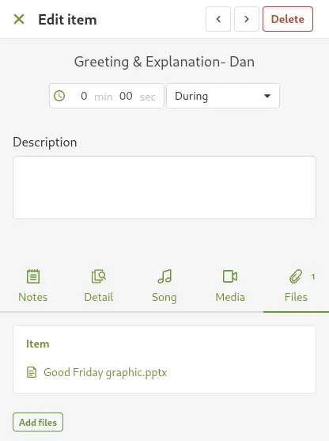
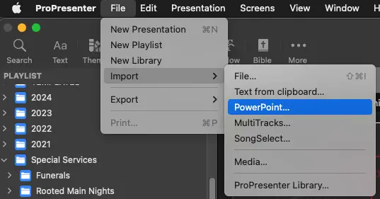
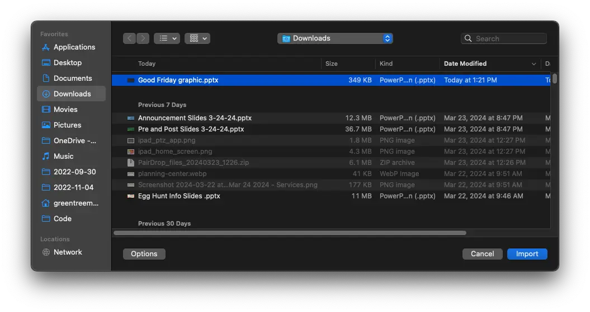
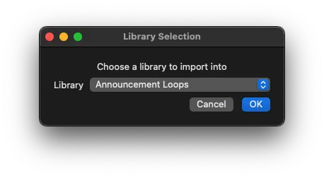
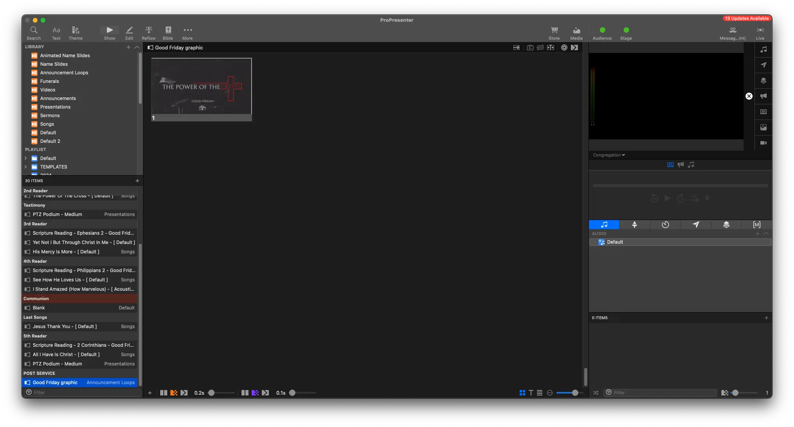
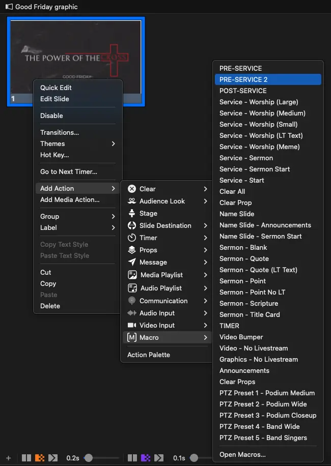
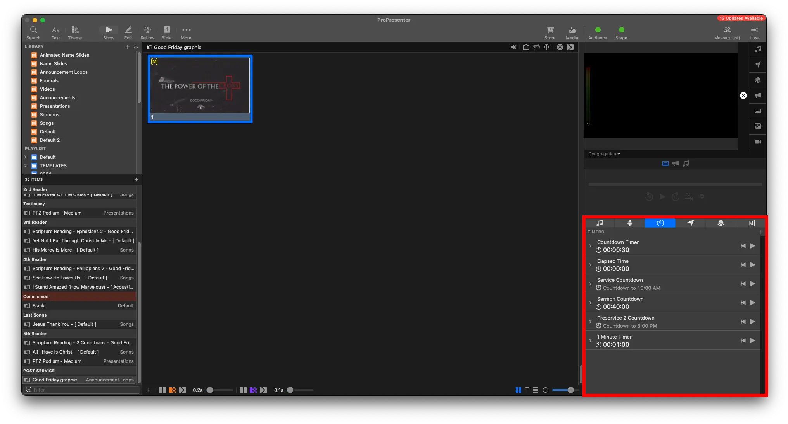
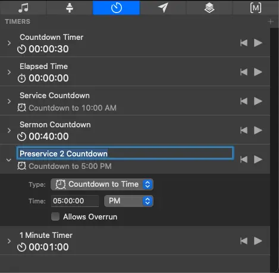
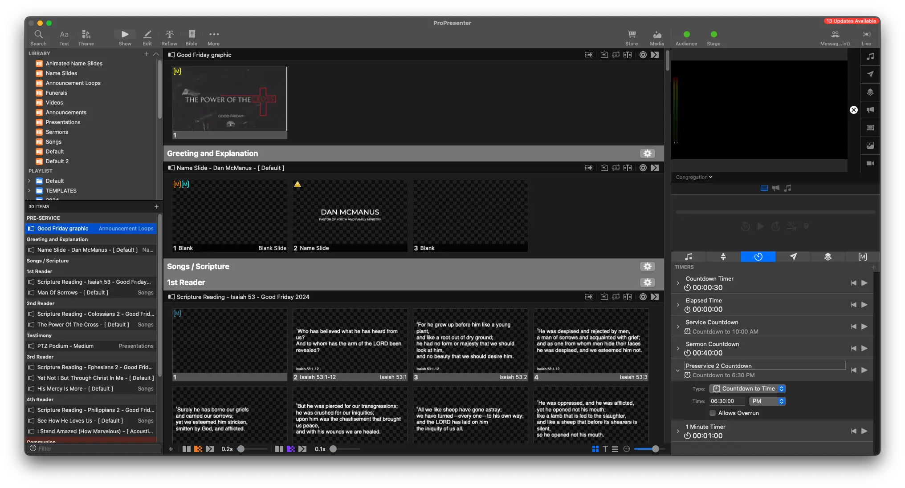

# Service Graphic

## Intro

Some services will have a one time graphic needed. It's a very similar process to [adding announcements.](../announcements/announcement-loops)

With a Special Service Graphics, it's typically only needed for one night or for the special event.

This is the special graphic we'll be adding.

Here's how to add it.

## Written Guide

### Planning Center

In Planning Center, we'll find the service graphic attached at the **Greeting / Inro**

You can see it's a PPTX, or PowerPoint file.

Download the file.

### ProPresenter

1. In ProPresenter, go to `File -> Import -> PowerPoint`

   

2. Select the PowerPoint, and click Import
   
3. Import into the **Announcement Loops** library, and select OK

   

4. The Presentation will be imported and added at the end of the Playlist

   

5. Add the `File -> Import -> PowerPoint` by selecting `Add Action -> Macro -> Pre Service 2`

   

6. At the bottom right, go to the **Timers** Tab

   

7. Change **Pre Service 2 Timer** to be at the start of the service

   <!--  -->

   

8. With our slide now properly added, let's move it where it needs to be. In this case, at the greeting / before service.

   

The one time service graphic is now added to the playlist properly.

## Video
