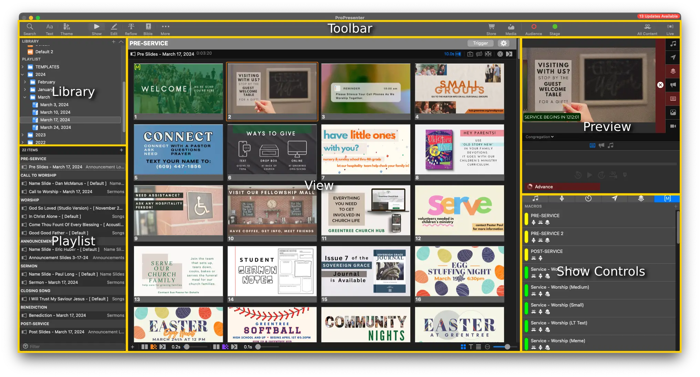

# Getting Started

Let's learn **ProPresenter in less than 5 minutes**.

## Navigating ProPresenter

The interface of ProPresenter is split up into a few main sections

1. The main area is the View Mode, where you see, interact with, and build your Slides
2. Across the top you have the Toolbar which quickly gets you to different areas of ProPresenter
3. Along the left is where you see all of the Presentations in your Libraries as well as where you will build your Playlists
4. The bottom features your Media Bin (which is normally hidden), giving you quick access to your Image/Video Media files
5. The top right is all about what is going out of ProPresenter; see the Preview, click on a Clear button or see the progress of the currently playing video or audio in this area
6. The bottom right features Show Controls area, where you can trigger audio files, change Stage Layouts, configure and start Timers, configure and send Messages, configure and trigger Props, and create and trigger Macros.

In ProPresenter 7, the main areas you'll be working in are the **View Mode**, **Library**, and the **Edit Page**

## Operator's Guide vs Slide Builders Guide

If you're just starting out, you should only be running the slides.

You can find the [Operator's Guide to ProPresenter 7](../category/slide-operator-guide) here.

You can find information on build out slides and presentations in the [Slide Builders's Guide to ProPresenter 7](./2-builder-guide/1-creating-first-presentation.md) here.
